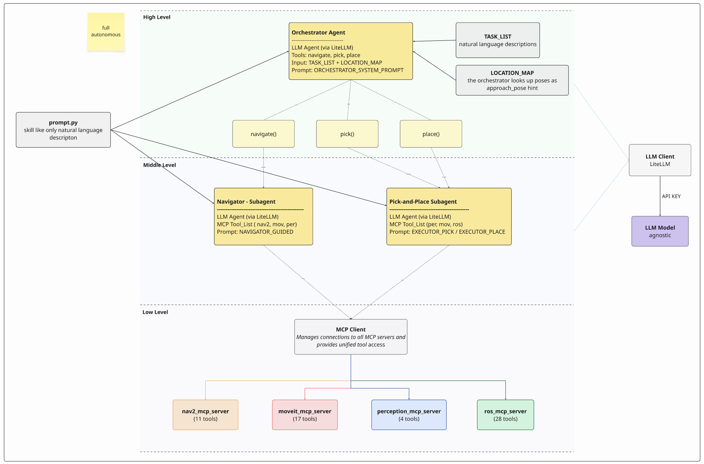

# Multi-Agent Room Cleaning System

A three-agent system for autonomous pick-and-place tasks on a Summit XL mobile manipulator using ROS 2 Jazzy. Built with [LiteLLM](https://github.com/BerriAI/litellm) (provider-agnostic) and [MCP](https://modelcontextprotocol.io/) (Model Context Protocol) for robot control.

## Architecture



- **Orchestrator** — owns the task list and location map. Decomposes "pick X from A, place on B" into navigate/pick/place tool calls.
- **Navigator** — narrow skill that drives to a given `(x, y, yaw)` pose and verifies arrival using `describe_scene` (Claude Vision). Does NOT explore.
- **Executor** — handles perception (segmentation, grasp planning) and manipulation (MoveIt motion planning, gripper control).

All robot interaction goes through 4 MCP servers (ros, moveit, nav2, perception) — no Python scripts touch ROS directly.

## Prerequisites

- ROS 2 Jazzy environment with Summit XL simulation running
- Rosbridge WebSocket server on port 9090
- 4 MCP servers running (see `start_mcp_servers.sh`):
  - `ros-mcp-server` on port 8888
  - `moveit-mcp-server` on port 8001
  - `nav2-mcp-server` on port 8002
  - `perception-mcp-server` on port 8003

## Setup

1. Install Python dependencies:

```bash
pip install litellm mcp --break-system-packages
```

2. Configure environment variables:

```bash
cp .env.example .env
# Edit .env and set your API key
```

3. Make sure the MCP servers are running:

```bash
cd ~/rap
./start_mcp_servers.sh
```

4. Verify the `.mcp.json` file exists in the parent directory (`~/rap/.mcp.json`) with the correct server URLs.

## Usage

### Full orchestrator (all three agents)

```bash
python -m multi_agent.main
```

### Test executor only (pick + place on same surface)

Assumes the robot is already positioned in front of the target object.

```bash
python -m multi_agent.main --test-executor
```

### Test navigator only (drive to a location)

```bash
python -m multi_agent.main --test-navigator
```

### Verbose logging

```bash
python -m multi_agent.main -v
```

## Configuration

Edit `main.py` to customize:

- **`LOCATION_MAP`** — known locations with `(x, y, yaw)` approach poses in the map frame
- **`TASK_LIST`** — objects to pick, where to pick them from, and where to place them

## Project Structure

```
multi_agent/
├── main.py           # Entry point, config, CLI
├── orchestrator.py   # Top-level planner agent
├── navigator.py      # Navigation skill agent
├── executor.py       # Pick/place manipulation agent
├── llm_client.py     # Provider-agnostic LLM wrapper (LiteLLM)
├── mcp_client.py     # MCP server connection manager
├── prompts.py        # System prompts for all agents
├── .env.example      # Environment variable template
└── README.md
```
